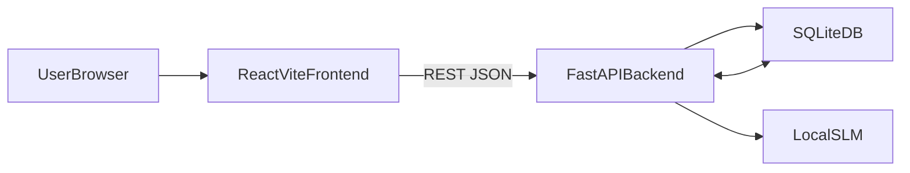

## NL-to-SQL App

Simple local app that turns natural language questions into SQL queries, using a small open-source model from Hugging Face, a FastAPI backend, and a React + Vite + TypeScript frontend. It stores users, sessions, messages, and schemas in a single SQLite database and uses the last 5 messages as conversational context for each query.

### Architecture

- **Frontend**: React + Vite + TypeScript, minimal CSS, chat-style UI, schema management form, session list.
- **Backend**: FastAPI + SQLAlchemy + Pydantic, REST APIs for users, schemas, sessions, and messages.
- **Database**: SQLite file (`nl_to_sql.db`) in the project root.
- **Model**: Small instruction model from Hugging Face (default: `Qwen/Qwen2.5-0.5B-Instruct`) loaded locally via `transformers`.



### Repository layout

- `readme.md` – this document.
- `backend/`
  - `requirements.txt`
  - `app/`
    - `main.py` – FastAPI app entrypoint, routes, CORS, health check, user bootstrap.
    - `config.py` – settings (DB URL, HF model name, CORS origins, generation params).
    - `db.py` – SQLAlchemy engine, session factory, `Base`, `init_db()`.
    - `models.py` – SQLAlchemy ORM models (`User`, `Session`, `Message`, `Schema`).
    - `schemas.py` – Pydantic models for API I/O.
    - `routes/`
      - `schema.py` – CRUD for schemas.
      - `chat.py` – sessions and messages (NL-to-SQL endpoint).
    - `services/`
      - `session_service.py` – utilities for users, sessions, messages, last-5 history.
      - `model_service.py` – Hugging Face model wrapper and SQL generation.
- `frontend/`
  - `index.html`
  - `vite.config.ts`
  - `tsconfig.json`
  - `package.json`
  - `src/`
    - `main.tsx` – React root.
    - `App.tsx` – main layout, data fetching, state wiring.
    - `index.css` – minimal dark theme styles.
    - `api/client.ts` – small fetch wrapper for backend APIs.
    - `components/SchemaForm.tsx` – create a schema (name, description, raw schema).
    - `components/SessionList.tsx` – sessions sidebar + active schema selector.
    - `components/Chat.tsx` – chat view and SQL display.

### Data model (SQLite via SQLAlchemy)

Defined in `backend/app/models.py`:

- **`User`**
  - `id` – primary key.
  - `external_id` – cookie-based identifier (random UUID hex).
  - `created_at` – creation timestamp.
- **`Session`**
  - `id` – primary key.
  - `user_id` – FK → `User.id`.
  - `title` – optional title.
  - `schema_id` – optional FK → `Schema.id` (active schema for this session).
  - `created_at`, `updated_at`.
- **`Message`**
  - `id` – primary key.
  - `session_id` – FK → `Session.id`.
  - `role` – `"user" | "assistant" | "system"`.
  - `content` – message text (for assistant, this includes generated SQL).
  - `created_at`.
- **`Schema`**
  - `id` – primary key.
  - `user_id` – FK → `User.id`.
  - `name` – unique per user.
  - `description` – optional.
  - `raw_schema` – text where you paste table DDL or a structured description.
  - `created_at`, `updated_at`.

The backend:

- always looks up sessions by `user_id` to isolate data,
- loads the last **5 messages** for a session (ordered by `created_at`) as conversational context for the model,
- includes the active schema text (if `schema_id` is set) in the prompt.

### Backend API

Base URL: `http://localhost:8000`

#### Health

- **GET `/health`**
  - Returns `{ "status": "ok" }` when the API is up.

#### User bootstrap

- **GET `/api/users/bootstrap`**
  - If `user_id` cookie is missing:
    - generates a new random external id,
    - creates `User` row with that `external_id`,
    - sets `user_id` HTTP-only cookie.
  - Returns: `{ "user_id": number }`.

#### Schemas

All schema routes require the `user_id` cookie – they operate only on schemas owned by that user.

- **GET `/api/schemas`**
  - Response: `Schema[]` (all schemas for current user).
- **POST `/api/schemas`**
  - Body:
    - `name: string`
    - `description?: string`
    - `raw_schema: string`
  - Response: created `Schema`.
- **PATCH `/api/schemas/{schema_id}`**
  - Body (all optional):
    - `name?: string`
    - `description?: string`
    - `raw_schema?: string`
  - Response: updated `Schema`.
- **DELETE `/api/schemas/{schema_id}`**
  - Response: empty (204) on success.

#### Sessions

- **GET `/api/sessions?limit=20`**
  - Response: `Session[]`, newest first.
- **POST `/api/sessions`**
  - Body:
    - `title?: string`
    - `schema_id?: number` – active schema for this session.
  - Response: created `Session`.

#### Messages and NL-to-SQL

- **GET `/api/sessions/{session_id}/messages?limit=20`**
  - Response: `Message[]`, ascending by `created_at`.
- **POST `/api/sessions/{session_id}/messages`**
  - Body:
    - `content: string` – natural language question.
  - Backend flow:
    1. Validates that the `session_id` belongs to the current user.
    2. Inserts a `user` `Message` row with the provided `content`.
    3. Loads the last **5** messages for that session (including the new one).
    4. Looks up the session’s active `Schema` (if `schema_id` is set) and reads `raw_schema`.
    5. Builds a prompt with:
       - system instruction (convert NL to SQL),
       - schema text,
       - formatted last-5 conversation turns,
       - final user question and explicit “return only SQL in ```sql``` block” rule.
    6. Calls the local Hugging Face model via `model_service.generate_sql`.
    7. Extracts SQL from the model output, stores an `assistant` `Message` row with the SQL (and optional explanation).
    8. Returns:
       - `sql: string`
       - `explanation?: string | null` (currently `null` by default)
       - `raw_model_output: string`.

### Model integration

The model integration lives in `backend/app/services/model_service.py` and uses `transformers`:

- Loads the tokenizer and model lazily on first call via:
  - `AutoTokenizer.from_pretrained(settings.hf_model_name)`
  - `AutoModelForCausalLM.from_pretrained(settings.hf_model_name)`
- Wraps them in a `pipeline("text-generation", ...)`.
- Builds a single text prompt:
  - system rules (use only given schema, return single SQL, wrap in ` ```sql `),
  - schema text,
  - last 5 messages as simple `User:` / `Assistant:` / `System:` lines,
  - final user question + reminder to output SQL only.
- Calls the pipeline with:
  - `max_new_tokens`, `temperature`, `top_p` from `Settings`.
- Extracts SQL from ```sql``` or generic ``` code blocks; falls back to raw text if no block is found.

You can change the model by editing `hf_model_name` in `backend/app/config.py`, for example:

- `"Qwen/Qwen2.5-0.5B-Instruct"` (default),
- any other ≤1B-parameter instruction model that works with `AutoModelForCausalLM`.

> The first generation call will download the model weights from Hugging Face if not cached locally.

### Frontend behavior

The frontend lives under `frontend/` and is a minimal single-page React app:

- On load:
  - calls `GET /api/users/bootstrap` to ensure a `user_id` cookie and user row,
  - fetches schemas (`GET /api/schemas`) and sessions (`GET /api/sessions`),
  - selects the first session (if any).
- Sidebar (`SessionList` + `SchemaForm`):
  - **Sessions**:
    - list existing sessions and highlight the active one,
    - “New session” button uses the currently selected schema as `schema_id`.
  - **Schemas**:
    - `SchemaForm` lets you create a schema (name, description, raw schema text),
    - list of schemas in a `<select>` to choose which schema is “active” for new sessions.
- Chat area (`Chat`):
  - shows messages for the active session,
  - text input to send a new question:
    - optimistic user message is shown immediately,
    - backend is called via `POST /api/sessions/{session_id}/messages`,
    - then messages are re-fetched to pick up the stored assistant answer,
  - displays “Latest SQL” block with a copy-to-clipboard button.

### Setup

#### Prerequisites

- **Python**: 3.11+ recommended.
- **Node.js**: 18+ (for Vite / React dev server).
- **Internet access** (for first-time model download from Hugging Face).

#### Backend setup

From the project root (`NlptoSQL/`):

```bash
cd backend
python -m venv .venv
source .venv/bin/activate  # Windows: .venv\Scripts\activate
pip install --upgrade pip
pip install -r requirements.txt
```

Environment configuration (optional; defaults are fine for local dev):

- create `backend/.env` (or project-level `.env`) with, for example:

```bash
HF_MODEL_NAME=Qwen/Qwen2.5-0.5B-Instruct
DATABASE_URL=sqlite:///./nl_to_sql.db
# Allow both local dev and the deployed Vercel app by default
CORS_ORIGINS=http://localhost:5173,https://nlpto-sql.vercel.app
```

Run the API:

```bash
cd backend
uvicorn app.main:app --reload --port 8000
```

On startup, `init_db()` will create `nl_to_sql.db` and all tables if they don’t exist.

#### Frontend setup

In a separate terminal:

```bash
cd frontend
npm install
npm run dev
```

The app will start at `http://localhost:5173` and talk to `http://localhost:8000` using `fetch` with cookies enabled.

### Usage

1. Open `http://localhost:5173` in your browser.
2. The app bootstraps a user and loads schemas and sessions.
3. In the sidebar:
   - create a schema with a name and description,
   - paste your table DDL or a textual schema description into the textarea,
   - save – it appears in the schemas list and becomes the active schema.
4. Create a **New session** (it will be linked to the active schema).
5. In the chat area:
   - ask a question in natural language (e.g. “Show me the total sales per day for the last 7 days”),
   - the backend stores your message, gathers the last 5 messages and schema, and calls the model,
   - the generated SQL appears in the “Latest SQL” block and as an assistant message.
6. Copy the SQL and run it against your own database (read-only recommended).

Conversation memory:

- for each request the backend uses the **last 5 messages** of the session,
- this keeps prompts small but lets the model remember short context (follow-ups, clarifications).

### Configuration and customization

Edit `backend/app/config.py` (or override via environment variables) to customize:

- `database_url` – defaults to `sqlite:///./nl_to_sql.db`.
- `hf_model_name` – small instruction model from Hugging Face.
- `max_new_tokens` – length of generated SQL.
- `temperature`, `top_p` – sampling settings (low temperature is best for SQL).
- `cors_origins` – allowed frontend origins (default `http://localhost:5173`).

You can swap the model for any similar small checkpoint that works with `AutoModelForCausalLM`. Just be sure it is:

- instruction-tuned or chat-tuned,
- ≤1B parameters (for CPU-friendlier inference),
- hosted on Hugging Face or compatible with `transformers`.

### Development notes

- To **run backend in reload mode**:
  - `uvicorn app.main:app --reload --port 8000`.
- To **tweak prompt or SQL extraction**:
  - edit `backend/app/services/model_service.py`:
    - `_build_prompt` – how schema and history are formatted,
    - `_extract_sql_from_output` – regex for parsing ```sql code blocks.
- To **test SQL generation quickly**, add a small script that:
  - imports `generate_sql`,
  - passes a test schema and question,
  - prints the resulting SQL to the console.

This codebase is intentionally small and straightforward so you can iterate easily: swap models, adjust prompts, and extend the UI or API as needed.

